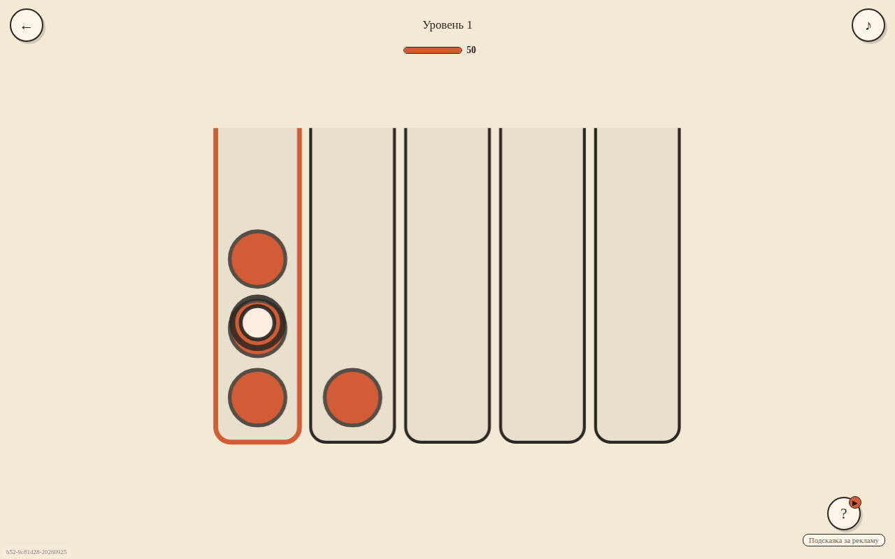

# Сортировка: Цвет и Форма

Собирайте в колбах одинаковые элементы. Красный круг и красный квадрат должны лежать в разных колбах.

[Играть в тестовую сборку](https://fanatat.github.io/games-dev/color-sort/)

Здесь размещена статическая версия для запуска в браузере.
Тестовая сборка может отличаться от файлов этого репозитория.

**Статус на 28 сентября 2026, подтверждён владельцем:** игра опубликована
в VK. В Яндекс Играх и CrazyGames пока не опубликована.



*Локальный запуск файлов этого репозитория, 28 сентября 2026.*

## Что это

Сортировка колб с двумя признаками: элементы отличаются цветом (три цвета) и формой (круг/квадрат), в одну колбу собираются только полностью одинаковые. 156 уровней, первые два — обучающие; раскладки сгенерированы офлайн и проверены солвером на решаемость (генератор в репозиторий не входит).
Подсказки за рекламу, энергия на попытки, серия входов с наградами, четыре цветовые темы оформления, статистика активного времени прохождения, конфетти на победе. Три цвета палитры разведены по светлоте, чтобы фигуры читались и при дальтонизме (проверка по luma описана в `board.js`). Web Audio воспроизводит записанные CC0-эффекты (MP3), встроенные в `sfx_data.js`; отдельные аудиофайлы не нужны. Событийная аналитика — Яндекс Метрика (`analytics.js`), без персональных данных.

## Стек

- vanilla JS, без сборщика (`?v=` в тегах штампует внешний `build.py`, в репозиторий не входит)
- Canvas 2D для поля (`board.js`), DOM для меню и экранов
- VK Bridge 3.0.2 (`vk-bridge.min.js`, локально), адаптер `vk_platform.js`; сохранение — VKWebAppStorage
- Словари RU/EN в `i18n.js`; в VK-сборке язык интерфейса фиксирован — русский

## Запуск локально

```bash
git clone https://github.com/Fanatat/Color_Sort-Vk.git
cd Color_Sort-Vk
python3 -m http.server 8000 --bind 127.0.0.1
```

Открыть `http://localhost:8000`. Вне VK игра стартует в dev-режиме (без рекламы и облачного сохранения).

## Моя роль

Игра собрана командой ИИ-агентов (Claude Code) под руководством автора: постановка задачи, приёмка живым запуском и тестами, релиз — автор; код — агенты.

SDK площадок обеспечивают авторизацию, рекламу, покупки и облачные сохранения
в соответствующем окружении. Локальный HTTP-сервер не воспроизводит эти интеграции.

## Состав репозитория

`board.js` — поле; `sound.js` и `sfx_data.js` — эффекты; `i18n.js` — словари;
`vk_platform.js` — интеграция VK. Генератор уровней и внешний `build.py` сюда не входят.
